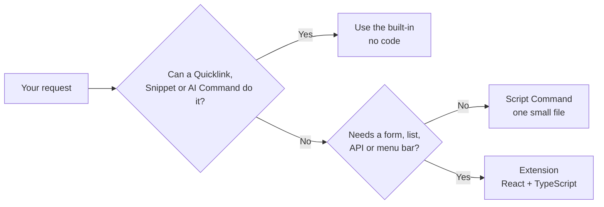

# 🔍✨ Raycast Agentic Skill


> A free skill file that teaches your AI coding assistant how to build Raycast commands and extensions the right way, the first time.

[](LICENSE.txt)
[](https://developers.raycast.com/)
[](https://github.com/adriangrantdotorg/Raycast-Skill/commits/main)
[](https://github.com/anthropics/skills)
[](#-contributing)

Works with **Claude Code**, **Cursor**, **OpenAI Codex**, **Gemini CLI**, **Google Antigravity**, **OpenCode**, and **Raycast AI** itself.

---

## 🤔 The Problem

Raycast lets you add your own commands to your Mac: a hotkey that runs a script, a form that saves a note, a menu bar timer.
Asking an AI assistant to build one sounds easy, but it usually goes sideways. The AI guesses at settings that changed months ago, builds a big app when a ten-line script would do, and hands you something that won't start. You end up debugging code you didn't write.

## 💡 The Solution

**Raycast Agentic Skill** is a set of notes your AI reads before it starts. It says which kind of command to build, which settings are current, and which mistakes to avoid. You describe what you want in plain words, and the AI builds it the way an experienced Raycast developer would.

| | 😩 Without the skill | 😌 With the skill |
| --- | --- | --- |
| "Make a hotkey that restarts my server" | A full extension with 200 lines and a build step | One small script, ready in Raycast in seconds |
| "Why won't my extension load?" | Guesses, rewrites, more guesses | Checks the build log first, where the real error is |
| Settings and API names | From the AI's memory, often out of date | Checked against Raycast API 2.5.0 docs |

---

## ⚖️ How It Compares

This skill doesn't replace your AI assistant. It plugs into the one you already use and makes it much better at Raycast. Here's how it stacks up against the paid tools people usually lean on:

| | **Raycast Agentic Skill** | [GitHub Copilot](https://github.com/features/copilot/plans) | [Cursor](https://cursor.com/pricing) | [Context7](https://context7.com/plans) |
| --- | :---: | :---: | :---: | :---: |
| 💰 Price | **Free** | Free tier · Pro $10/mo | Free tier · Pro $20/mo | Free tier · Pro $10/seat/mo |
| 🔓 Open source | ✅ | ❌ | ❌ | ⚠️ |
| 🧭 Raycast-specific rules (script vs. extension, UI patterns, auth, publishing) | ✅ | ❌ | ❌ | ❌ |
| 📚 Current Raycast API facts | ✅ | ⚠️ | ⚠️ | ✅ |
| 🔌 Works inside any AI coding tool | ✅ | ❌ | ❌ | ✅ |
| ✈️ Works offline (plain files on disk) | ✅ | ❌ | ❌ | ❌ |

<sub>✅ yes · ⚠️ partly (general AI knowledge or web lookup, not built in; Context7's client is open, its service isn't) · ❌ no · Prices and features checked 09-25-26.</sub>

**Use Context7 alongside it if** you want live docs for every library in your project, not just Raycast. The two work well together.

---

## ✨ Features

### 🧭 Picks the right tool for the job
Before writing any code, the AI decides between a **Script Command** (one small file, no build step) and a full **Extension** (forms, lists, API calls). It also checks whether a built-in Quicklink, Snippet, or AI Command already does the job with no code at all.


```mermaid
flowchart LR
    A[Your request] --> B{Can a Quicklink,<br/>Snippet or AI Command do it?}
    B -- Yes --> C[Use the built-in<br/>no code]
    B -- No --> D{Needs a form, list,<br/>API or menu bar?}
    D -- No --> E[Script Command<br/>one small file]
    D -- Yes --> F[Extension<br/>React + TypeScript]
```

### 📜 Script Commands done right
Every `@raycast.*` setting, argument types, output modes, exit codes, and the traps that hang Raycast (like SSH waiting on a password prompt nobody can see).

### 🎨 Extensions that feel native
Forms that close themselves when done, lists you can drive with the keyboard, remembered values, filter dropdowns, menu bar items, and background refresh.

### ⚡ Fast, cached data
Chooses the right `@raycast/utils` hook (`useCachedPromise`, `useFetch`, `useForm`…) so results show instantly and search-as-you-type doesn't flicker.

### 🔐 Tokens and sign-in
Stores API tokens in Raycast's encrypted preferences, shows setup steps next to the form, and uses Raycast's built-in OAuth for GitHub, Linear, Slack and others.

### 🤖 Raycast AI tools
Builds tools that Raycast AI can call ("@contacts find…"), with `ai.yaml` instructions and evals.

### 🩺 Debugging that finds the real error
Knows the quiet failures: a failed rebuild keeps the old code running, a copied `tsconfig.json` hides the generated types, a renamed extension loses its saved preferences.

### 📚 Four reference files
Condensed from the official Raycast docs (API 2.5.0, `@raycast/utils` 2.3.0), so the AI checks exact names instead of guessing: `platform.md`, `api-reference.md`, `utils-hooks.md`, `script-commands-and-app.md`.

---

## 📋 Prerequisites

- **[Raycast](https://www.raycast.com/)** — installed on your Mac
- **An AI coding assistant** that supports the [Agent Skills standard](https://github.com/anthropics/skills) — see the table below
- **[Node.js](https://nodejs.org/)** v22.22+ — only for building full Extensions; Script Commands don't need it

---

## 🚀 Installation

The skill lives in `skills/raycast/` in this repo. Copy that folder into your assistant's skills folder:

```bash
git clone https://github.com/adriangrantdotorg/Raycast-Skill.git /tmp/Raycast-Skill
cp -R /tmp/Raycast-Skill/skills/raycast ~/.claude/skills/
```

Swap `~/.claude/skills/` for your tool's folder:

| **Platform** | **Type** | **Skills folder** | **How it's used** |
| --- | --- | --- | --- |
| **Claude Code** | CLI / app | `~/.claude/skills/` | Automatically, when you mention Raycast |
| **Raycast AI** | Mac app | `~/.claude/skills/` (read automatically) | Automatically |
| **Cursor** | IDE | `.cursor/skills/` in your project | Mention `@raycast` in chat |
| **OpenAI Codex** | CLI | `~/.codex/skills/` | Automatically |
| **Gemini CLI** | CLI | `~/.gemini/skills/` | Automatically |
| **Google Antigravity** | IDE | `.agent/skills/` in your project | Automatically |
| **OpenCode** | IDE | `~/.config/opencode/skills/` | `skill({ name: "raycast" })` |

Keep the folder named `raycast`. Some tools, Raycast AI included, skip a skill whose folder name doesn't match its `name`.

**Verify:** ask your assistant "Which skills do you have for Raycast?" It should name this one.

---

## 💡 Usage

Just describe what you want. The skill kicks in on its own.

### A one-keystroke script

```
"Make a Raycast command that wakes my Mac Mini over the network."
```

The tool will:

- Pick a **Script Command**, since it's one shell action with no UI
- Add the `@raycast.*` header, a clear title, and `silent` mode
- Print a short reason and exit non-zero on failure, so Raycast shows a helpful error toast

### A form backed by an API

```
"Build a Raycast extension that adds a task to my Notion database, with a tag picker."
```

The tool will:

- Scaffold an **Extension** with the token in a required password preference
- Load existing tags with `useCachedPromise`, plus a field for creating new ones
- Close back to Raycast's search when the task is saved
- Explain the "Could not find database" error if the Notion integration isn't connected

### Running a Keyboard Maestro macro

```
"Create a command that runs my Keyboard Maestro macro."
```

The tool will:

- Use `runAppleScript` from `@raycast/utils`, passing the macro ID as an argument instead of pasting it into the script
- Set `"platforms": ["macOS"]` in `package.json`

---

## 🤝 Contributing

Contributions are welcome! Whether you're adding new patterns, fixing a stale API fact, or improving documentation — your help makes this project better for everyone 🙌🏾

**Quick Start for Contributors:**

```bash
git clone https://github.com/adriangrantdotorg/Raycast-Skill.git
cd Raycast-Skill
git checkout -b feature/your-pattern-or-fix
# edit skills/raycast/ and test it with your AI assistant
git commit -m "Add: description of your changes"
git push origin feature/your-pattern-or-fix
# then open a Pull Request on GitHub
```

When you correct an API fact, update the matching file in `skills/raycast/references/` and keep its source tag (`[Manifest]`, `[MAN]`…) so others can re-check it.

---

## 📚 Additional Resources

- **[Raycast API Docs](https://developers.raycast.com/)** — Official extension API reference
- **[Raycast Utils](https://developers.raycast.com/utilities/getting-started)** — React hooks and helpers
- **[Script Commands](https://github.com/raycast/script-commands)** — Official Script Commands repo and examples
- **[Agent Skills Standard](https://github.com/anthropics/skills)** — How skills work across AI tools
- **[Raycast Store](https://www.raycast.com/store)** — See what others have built

---

## 🐛 Issues & Support

Encountered a problem or have a suggestion?

- **Bug Reports** — [Open an issue](https://github.com/adriangrantdotorg/Raycast-Skill/issues/new)
- **Feature Requests** — [Request a feature](https://github.com/adriangrantdotorg/Raycast-Skill/issues/new)

---

## 📄 License

This project is licensed under the Apache 2.0 License — see [LICENSE.txt](LICENSE.txt) for details.

---

<div align="center">
  <sub>Built with ❤️ for the Raycast community & everyone teaching their AI new tricks ✌🏾</sub>
</div>
